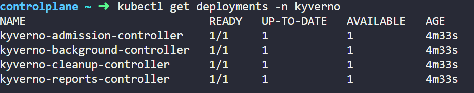

# kyverno-k8s

## Why Choose Kyverno?
- Native Kubernetes Integration: Kyverno is designed specifically for Kubernetes, offering policies as first-class Kubernetes resources.
- Simplicity: Writing and managing policies with Kyverno is straightforward, requiring no new languages or complex configurations.
- Flexibility: Kyverno supports validation, mutation, and generation of policies, covering a wide range of use cases from security to configuration management.

## Installing Kyverno Using Helm
```
- helm repo add kyverno https://kyverno.github.io/kyverno/
- helm repo update
```
## Kyverno CLI Installation

- Run the following commands to install Kyverno CLI in your lab machine.

```
- curl -LO https://github.com/kyverno/kyverno/releases/download/v1.12.0/kyverno-cli_v1.12.0_linux_x86_64.tar.gz
- tar -xvf kyverno-cli_v1.12.0_linux_x86_64.tar.gz
- sudo cp kyverno /usr/local/bin/
```

## Install Kyverno in kyverno namespace using the following command:
```
- helm install kyverno kyverno/kyverno -n kyverno --create-namespace
```
## Checking 
```
- kubectl get all -n kyverno
- kubectl get pods -n kyverno
- kubectl get deployments -n kyverno
- kubectl get services -n kyverno
- kubectl get crds | grep kyverno
```
- 

## Exercise 1 for mutating policies in kyverno

```
- kubectl apply -f add-default-resources.yaml
- kubectl apply -f add-environment-label.yaml
- kubectl apply -f pod-add-environment-label.yaml
```

## Exercise 2

```
- kubectl apply -f add-namespace-label.yaml
- kubectl create namespace kodekloud
- kubectl get namespace kodekloud --show-labels
```

## Exercise 3
- kyverno cli 
```
>> require-label.yaml

apiVersion: kyverno.io/v1
kind: ClusterPolicy
metadata:
  name: require-label
spec:
  validationFailureAction: Enforce
  rules:
  - name: check-for-label
    match:
      resources:
        kinds:
        - Pod
    validate:
      message: "The label 'environment: production' is required."
      pattern:
        metadata:
         labels:
           environment: production
---

>> pod-label.yaml

apiVersion: v1
kind: Pod
metadata:
  name: test-pod
spec:
  containers:
  - name: test-container
    image: nginx
---
Testing

- kyverno apply require-label.yaml --resource pod-label.yaml

```
## Exercise 4
- Lab A — Validate: require an app label on Pods
```
# file: cp-require-app-label.yaml
apiVersion: kyverno.io/v1
kind: ClusterPolicy
metadata:
name: require-app-label
spec:
validationFailureAction: Audit
background: true
rules:
- name: require-app-label
match:
any:
- resources:
kinds:
- Pod
validate:
message: "Pods must have app.kubernetes.io/name label"
pattern:
metadata:
labels:
app.kubernetes.io/name: "?*"
---
kubectl apply -f cp-require-app-label.yaml
---
# file: pod-no-label.yaml
apiVersion: v1
kind: Pod
metadata:
name: test-no-label
spec:
containers:
- name: c
image: nginx:1.25.5
ports:
- containerPort: 80
-----
kubectl apply -f pod-no-label.yaml
# See policy reports
kubectl get policyreport -A
kubectl get policyreport -n default -o yaml | grep -A4 "require-app-label" || true
---
# file: pod-with-label.yaml
apiVersion: v1
kind: Pod
metadata:
name: test-with-label
labels:
app.kubernetes.io/name: web
spec:
containers:
- name: c
image: nginx:1.25.5
---
kubectl apply -f pod-with-label.yaml
kubectl get pods -o wide

```
- Lab B — Mutate: auto‑add a default label
```
# file: cp-add-default-label.yaml
apiVersion: kyverno.io/v1
kind: ClusterPolicy
metadata:
name: add-default-label
spec:
background: true
rules:
- name: add-default-label
match:
any:
- resources:
kinds:
- Pod
mutate:
patchStrategicMerge:
metadata:
labels:
+(app.kubernetes.io/name): default-app
---
kubectl apply -f cp-add-default-label.yaml
kubectl delete pod test-no-label --ignore-not-found
kubectl apply -f pod-no-label.yaml
kubectl get pod test-no-label -o jsonpath='{.metadata.labels}' && echo

- Expected: label app.kubernetes.io/name=default-app has been added by mutation.

```
- Lab C — Validate: disallow :latest image tags

```
# file: cp-disallow-latest.yaml
apiVersion: kyverno.io/v1
kind: ClusterPolicy
metadata:
name: disallow-latest-tag
spec:
validationFailureAction: Enforce
background: true
rules:
- name: no-latest
match:
any:
- resources:
kinds:
- Pod
- Deployment
validate:
message: "Images must use an explicit, non-latest tag"
pattern:
spec:
containers:
- name: "*"
image: "!*:latest"
---
# file: pod-uses-latest.yaml
apiVersion: v1
kind: Pod
metadata:
name: latest-bad
spec:
containers:
- name: c
image: nginx:latest

- kubectl apply -f pod-uses-latest.yaml # expect deny
---
# file: pod-uses-version.yaml
apiVersion: v1
kind: Pod
metadata:
name: version-good
spec:
containers:
- name: c
image: nginx:1.25.5

- kubectl apply -f pod-uses-version.yaml
```
